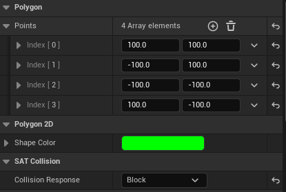
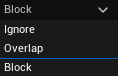
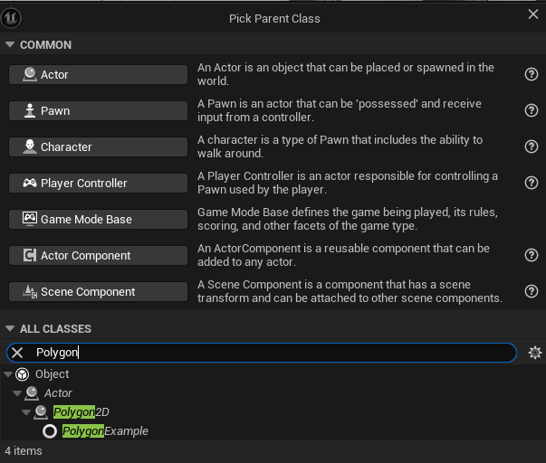
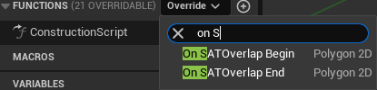
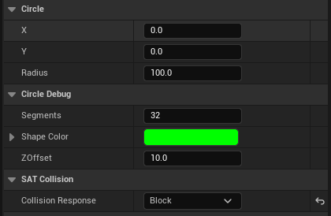
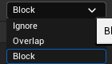
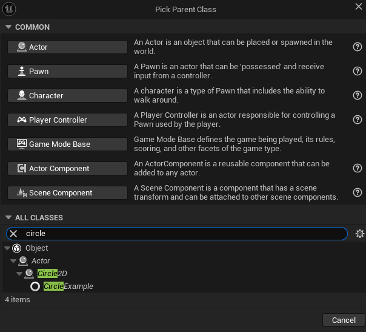
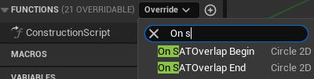

# 2D SAT Collisions Plugin Unreal

**SATCollisions** is an Unreal Engine plugin that implements 2D collision detection using the **Separating Axis Theorem (SAT)**. It supports convex polygons and circles, and includes inheritable custom actors (`APolygon2D`, `ACircle2D`) with automatic overlap detection events, via C++ and Blueprints, `OnOverlapBegin` and `OnOverlapEnd` events.

---

## Features

- Automatic overlap detection system
- Accurate SAT-based collision for convex shapes
- Circle vs Circle, Circle vs Polygon, Polygon vs Polygon collisions
- Easily extendable via C++ or Blueprint
- Visual debug rendering of shapes and collision status

---

## Installation

1. Copy the `2DSATCollisions` plugin folder into your project's `Plugins` directory:
    ```
    UnrealProject/
    -- Plugins/
        -- 2DSATCollisions/ <-- here
    ```

2. Regenerate the project files and then rebuild the project.

3. IN CASE IT IS NOT ENABLED ALREADY BY DEFAULT, enable the plugin in **Edit > Plugins > Installed > 2DSATCollisions** .

---

## Usage

### Polygon 2D

The ``Polygon 2D`` class let's you make a polygon of any convex shape, and the ``SAT Collision`` Subsystem will automatically grab it and apply the collisions to it. It also contains the virtual ``OnSATOverlapBegin`` and ``OnSATOverlapEnd`` which get called when the ovelap start or ends, respectively.

#### Editor 



From the editor, you can change and add as many ``points`` as needed to make the polygon, though **COLLISION BEGINS WHEN YOU GET TO 3 OR MORE POINTS**. The shape colour of the debug lines can be defined here as well, but the on overlap or on collision colour will always be **RED**. 



Lastly, the collision response of the object is either ``No Collision``, ``Overlap`` (for only overlaps) and ``Blocking`` (for when you want the colliders to bounce).

#### Creating an inherited Polygon 2D through blueprints.

1) Right-click in the Content Browser.

2) Choose Blueprint Class ->  All Classes -> Polygon2D 



3) In the Blueprint, override ``OnSATOverlapBegin`` and ``OnSATOverlapEnd``



#### Creating an inherited Polygon 2D through C++

```c++
#pragma once

#include "CoreMinimal.h"
#include "Polygon2D.h"
#include "ExamplePolygon2D.generated.h"

UCLASS()
class AExamplePolygon2D : public APolygon2D
{
	GENERATED_BODY()

public:
	AExamplePolygon2D();

protected:
	virtual void OnSATOverlapBegin_Implementation(AActor* OtherActor) override;
	virtual void OnSATOverlapEnd_Implementation(AActor* OtherActor) override;
};
```

### Circle 2D

The ``Circle 2D`` class let's you make a circle of any size, and the ``SAT Collision`` Subsystem will automatically grab it and apply the collisions to it. It also contains the virtual ``OnSATOverlapBegin`` and ``OnSATOverlapEnd`` which get called when the ovelap start or ends, respectively.

#### Editor 



From the editor, you can change the circle's local x and y positions if need be and the radius' size. In order to debug, you can also choose the number of segments it has and its ZOffset in case the circle is too close to the ground adn you want to see it.



Lastly, the collision response of the object is either ``No Collision``, ``Overlap`` (for only overlaps) and ``Blocking`` (for when you want the colliders to bounce).

#### Creating an inherited Circle 2D through blueprints.

1) Right-click in the Content Browser.

2) Choose Blueprint Class ->  All Classes -> Circle2D 



3) In the Blueprint, override ``OnSATOverlapBegin`` and ``OnSATOverlapEnd``



#### Creating an inherited Circle 2D through C++

```c++
#pragma once

#include "CoreMinimal.h"
#include "Polygon2D.h"
#include "ExampleCircle2D.generated.h"

UCLASS()
class AExampleCircle2D : public ACircle2D
{
	GENERATED_BODY()

public:
	AExampleCircle2D();

protected:
	virtual void OnSATOverlapBegin_Implementation(AActor* OtherActor) override;
	virtual void OnSATOverlapEnd_Implementation(AActor* OtherActor) override;
};
```

